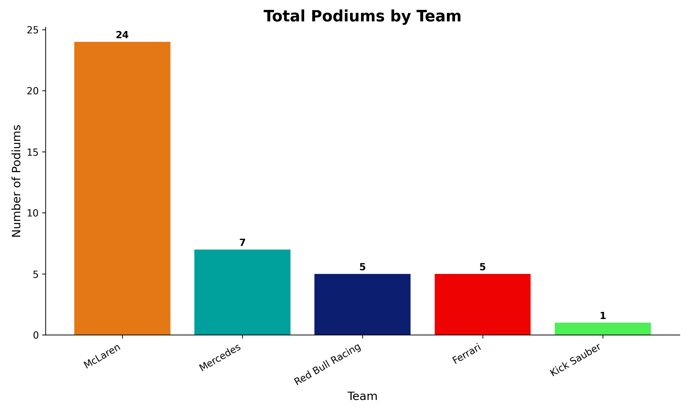

# 🏎️ Formula 1 Podium Analysis (2025 Season)

**Goal:** Analyze Formula 1 podium finishes using **Python**, **Pandas**, and **Matplotlib**, and create a clear visualization of team performance.

---

## 📌 Features
✔ Aggregates podium finishes (P1, P2, P3) for each team  
✔ Produces a **color-coded bar chart** for easy interpretation  
✔ High-resolution visualization for presentations or reports  
✔ Clean, structured Python code using `pandas` and `matplotlib`  

---

## 🛠️ Tools & Libraries
- Python 3.x
- Pandas
- Matplotlib

---

## 📊 Visualization
Here’s the final output of the analysis:



---

## 🚀 How to Run This Project
1. Clone the repository:
   ```bash
   git clone https://github.com/kjssilva/F1-Podium-Analysis_2025.git
